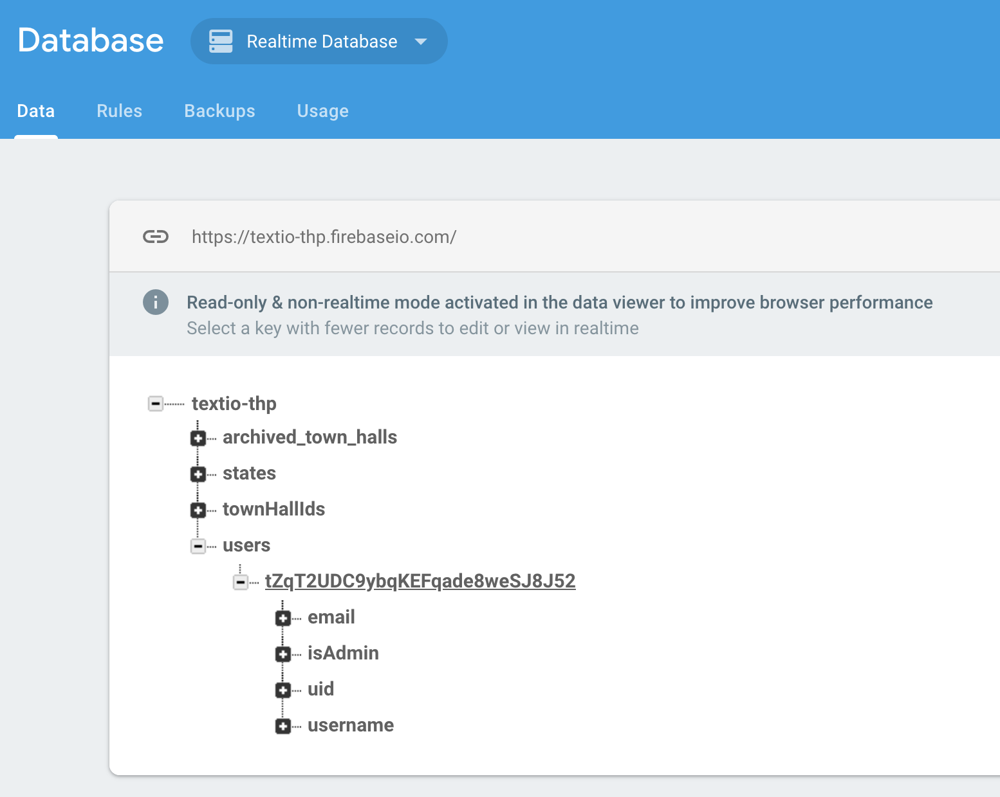
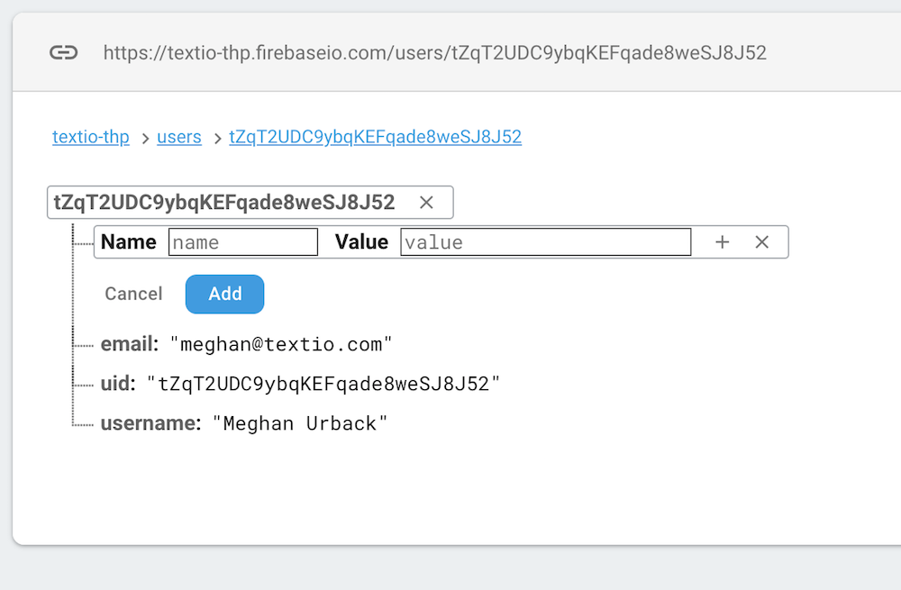

# 💻 Developer environment setup: 💻

The below guide will take you through the steps of downloading the project files and setting up the online database (Google Firebase). In the future, there will be an easier process hooking into a pre-configured database.

This setup process is fairly lengthy, but it's not too bad if you stick with it! Also, to make sure it gets easier for future developers, make sure to write down or edit this readme with any errors you come across! This will make it easier for future developers to get started on the project!

Good luck!

---
## 0. Before you start
#### The general development workflow is as follows:
- Fork the THP admin repo
- Make changes to your forked repo
- Send PRs from the forked repo to the main THP repo

#### Merging your changes to the main THP repo
1. update your forked master branch to match the main THP master branch:
- Set up the original THP admin repo as a remote (this only has to be done once):
  `git remote add upstream https://github.com/townhallproject/admin.git`
  - To verify that the remote was added: `git remote -v`
- `git checkout master`
- `git pull upstream master`
  - this brings all new content from the main THP repo into the current branch of your cloned repo
- `git push origin master`
  - this sends those changes to your fork

2. Rebase your topic branch onto your fork's master, which is now up to date with everyone elses changes:
- `git checkout <your branch>`
- `git rebase master`
  - if there are any problems they will become apparent here
- `git push origin master`

3. Create a pull request to the main THP repo master
- use the github UI


## 1. Download the files

- Clone this repository to a folder of your choice on your local machine:
  ```git clone <repo URL>```
- Navigate to the newly cloned repository folder
- Install the project dependencies:
  ```npm i```
- **Optionally**, you can try to start the project 
  ```npm start```
This should throw an error: `Error: FIREBASE FATAL ERROR: Can't determine Firebase Database URL.` Which means everything is working except you don't have `Firebase` installed yet.
---
## 2. Setting up Firebase
- Create a new file in the root directory of the repository named simply: `.env` , this will store your local development environment variables. Leave it blank for now.

- Next you will need to crate a `Firebase` account for testing purposes:
  - Navigate to: `https://console.firebase.google.com/`
  - **OR** simply Google: `Firebase console`. You will need to sign in to your Google account.
  - Click on the `Add Project` / `create a project` button
  - Fill in the information, it doesn't really matter what you put since this is only a personal test database.
  - Click thru the following menus, accepting default suggestions on any database-specific questions. Feel free to not share analytics data with Google.
  - Click on `Develop` on the left hand menu
  - Click on `Database`. From now on Google should remember your selections.
  - Click on `Create Database`
  - On the menu that pops up: Click on `Start in test mode`
  - Click `Enable`
  - Go to `project overview` tab on the left nav bar
  - Click on the button with this icon: `</>`
  - Enter a nickname for your app (can by anything)
  - Click `register app`
  - The JSON information in the following popup is what you need to put into your `.env` file.

- Now, you can fill in the following data into your `.env` file:
  ```
  REACT_APP_TESTING_FIREBASE_API_KEY=
  REACT_APP_TESTING_FIREBASE_AUTH_DOMAIN=[TESTING APP NAME].firebaseapp.com
  REACT_APP_TESTING_DATABASE_URL=https://[TESTING APP NAME].firebaseio.com 
  REACT_APP_TESTING_PROJECT_ID=[TESTING APP NAME]
  REACT_APP_TESTING_STORAGE_BUCKET=[TESTING APP NAME].appspot.com 
  REACT_APP_TESTING_MESSAGING_SENDER_ID=[TESTING APP ID]
  NODE_ENV=dev
  ```

- The mapping of environment variables is below (it's a 1:1 mapping):
  apiKey -> REACT_APP_TESTING_FIREBASE_API_KEY
  authDomain -> REACT_APP_TESTING_FIREBASE_AUTH_DOMAIN
  databaseURL -> REACT_APP_TESTING_DATABASE_URL
  projectId -> REACT_APP_TESTING_PROJECT_ID
  storageBucket -> REACT_APP_TESTING_STORAGE_BUCKET
  messagingSenderId -> REACT_APP_TESTING_MESSAGING_SENDER_ID
&nbsp;
- **IMPORTANT NOTE!** Remove ALL quotation marks in the `.env` file, this can stop your app from working. (it has caused problems in the past)

### Set up Firebase OAuth
  - Navigate to the firebase console `https://console.firebase.google.com/u/0/`
  - Navigate to your project
  - On the left-hand nav go to `Develop` --> `Authentication`
  - On the horizontal nav bar in the center of the screen go to: `Sign-in method`
  - Select `Google` --> `Enable` --> `Save`

### Set up the OAuth consent screen
- Now, set up the Google OAuth consent screen: (official instructions here: https://support.google.com/cloud/answer/6158849?hl=en )
  - Navigate to the Google cloud console: `https://console.cloud.google.com`
  - In the top nav bar, select the dropdown project selector
    - If your project is listed, select it and click `open`
    - If your project is not listed, type its name into the search bar and it should appear. If not try entering the name into the landing page search bar. If still not, try waiting a moment.
  - In the very top left corner select the `hamburger menu` --> `API's and Services`
  - If the button `Configure consent screen` / `OAuth consent screen` does not appear, you may have to go thru the rest of the official instruction steps (link above).
  - Generic instructions for setting up the consent screen are here: https://support.google.com/cloud/answer/6158849?hl=en
    - Application name: Town Hall Project
    - Add contact info: your email
    - Add an authorized domain: townhallproject.com
---
## 3. Setting up your Firebase user

Try starting the app ```npm start``` in the terminal (from the project root directory). 

This should open a web browser pointed at: `http://localhost:3000` prompting you to log in the view the admin site. If not, something is wrong. If everything has gone according to plan so far you should get the following error:

`USER_REQUEST_FAILED: Error: permission_denied at /users/<some long string>: Client doesn't have permission to access the desired data.`

This indicates that you are not a user who has permissions on Firebase. Make yourself a user with the following steps:

- Navigate to the firebase console (https://console.firebase.google.com)
- `Left side nav` --> `develop` --> `database` --> ...
  - You now need to make sure to select the `realtime database`
  - This either appears as a dropdown or one of two buttons
- ... --> `realtime database` --> `rules`
  
- For now, change the database rules to appear as follows (later, we'll add a full set of rules so that our database behaves like the production database):

  ```
  {
    /* Visit https://firebase.google.com/docs/database/security to learn more about security rules. */
    "rules": {
      ".read": true,
      ".write": true
    }
  }
  ```
- click `publish`
- now `refresh` the login page
  - You should see a `Request access` page with the following options:
    - `Download RSVPs to events`
    - `Download Events`
    - `Access to our Member of Congress database`
    - `Full Admin`
- Select `Full Admin` and press `Submit` 


- Now, you need to approve yourself as an admin
  - Go to the `firebase console` --> `develop` --> `Database` --> `realtime database`
  - Expand the database until you see 'users' and then find your user id
  
  - Hover over the long random ID number for your user entry
  
  - Click on the `+` icon
  - In the `Name` field enter (exactly): `isAdmin`
  - In the `Value` field enter (exactly): `true`
  - Click `Add`

  - Go back to and refresh the THP login page that opened with you ran `npm start` (you should now be logged in as an admin, and see a left side nav)
  - Click `manage data access` on the left left side nav
  - Click `approve` under your pending approval
  - Go back to the firebase console to verify that the `pending_access_request` is gone
---
## 4. Setting the Firebase rules
This step makes your testing database behave the same as the production database, which is important for discovering bugs in your fresh code.

- Navigate to the firebase console (https://console.firebase.google.com)
- `Left side nav` --> `develop` --> `database` --> `realtime database` --> `rules`
- In your local files, the rules to use are saved here: `lib/dbrules.txt`
- Open `lib/dbrules.txt` and copy the contents in to the Firebase rules window, replacing everything that is there already
- Don't forget to Scroll back to the top of the page and press `publish`
- You're done
---

## 5. Devtools setup
React and Redux devtools can be helpful tools to install for debugging in Chrome:
- [React devtools chrome extension](https://chrome.google.com/webstore/detail/react-developer-tools/fmkadmapgofadopljbjfkapdkoienihi?hl=en)
- [Redux devtools chrome extension](https://chrome.google.com/webstore/detail/redux-devtools/lmhkpmbekcpmknklioeibfkpmmfibljd)

---
## 6. 🎂 Congratulations you're done 🎂
When you encounter new problems, make SURE to edit this `README` with updated information so that future coders can spend more time being productive!

---


  
